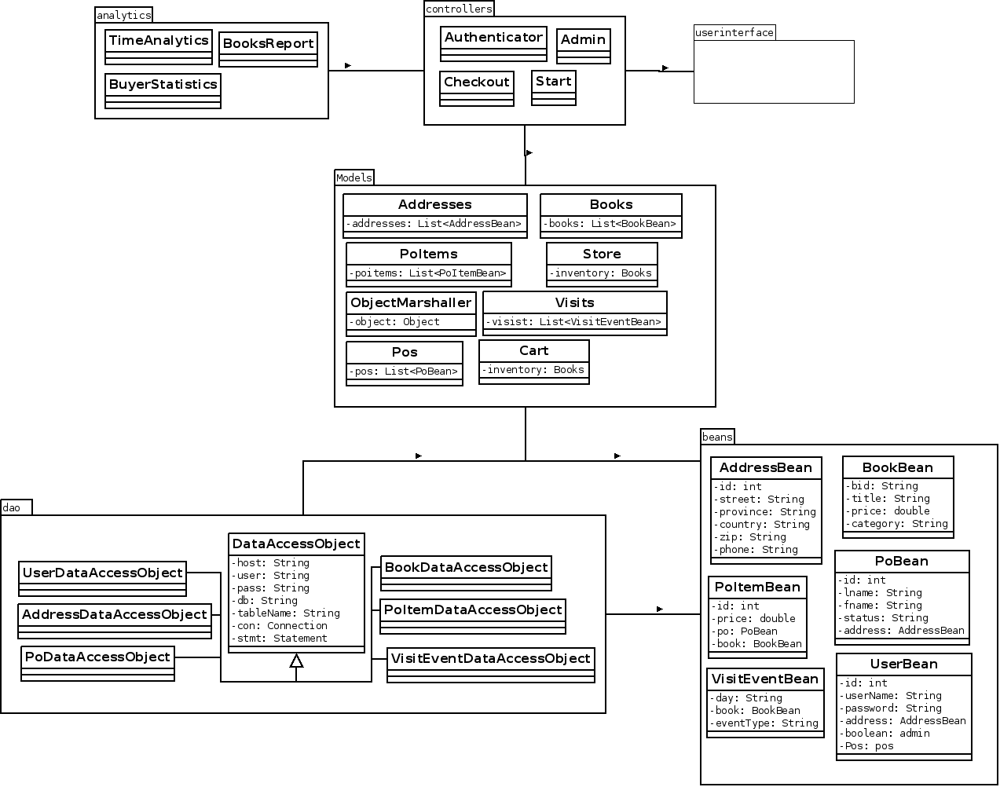
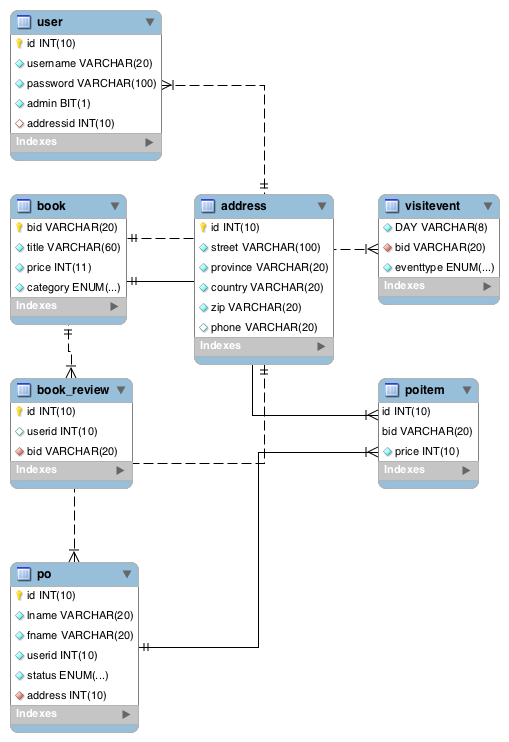
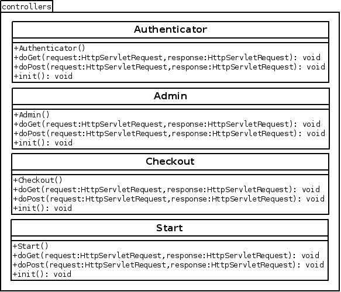

# System Architecture

## UML Use Case Diagram

The above use diagram was extracted from the requirement descriptions provided. All people visiting the web application are allowed to log in, log out, or register. Visitors or customers are then also permitted to interact with the cart by adding or removing items from the card, and finally may place an order. Administrators are able to generate reports, and partners are able to interact with the SOAP API.

\newpage

## UML Class Diagram

### Full UML Class Diagram

\newpage

### Database Scheme

\newpage

### Java Beans

\newpage

### Data Access Objects

\newpage

### Models

  

\newpage

### Controllers

\newpage

