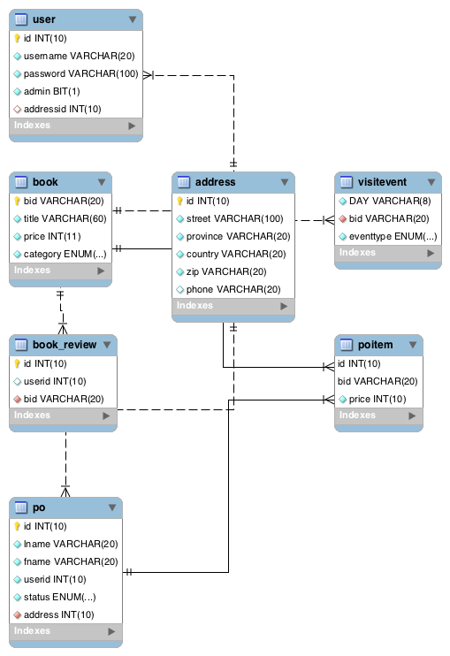
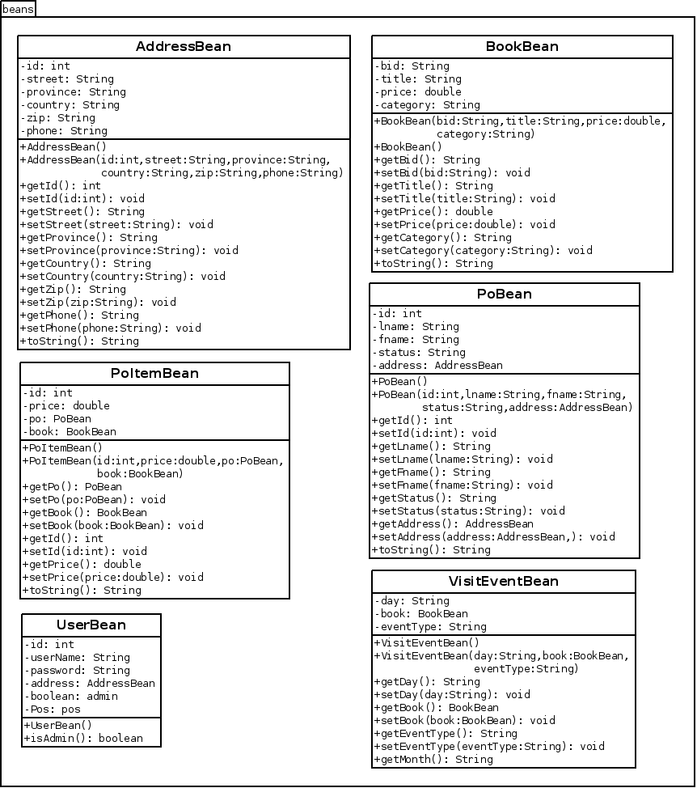
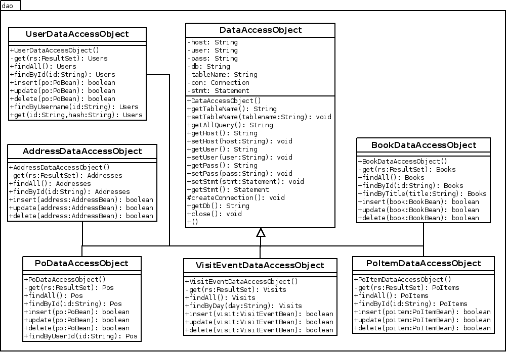
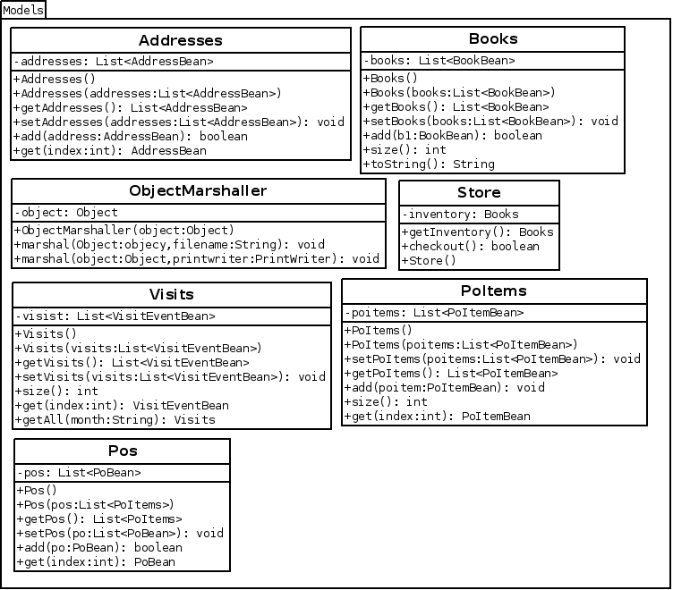
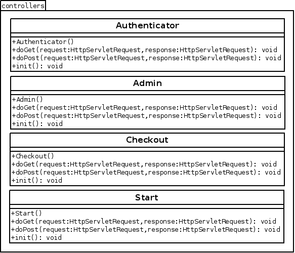

# Implementation

In the implementation portion of the design document, we discuss the design
decision which we have chosen. This is broken up into the following sections User Interface, Data Layer (corresponds to the Data Access Object and beans packages), Models (models package), Controllers (controllers), and Analytics (analytics).

## User Interface

The user interface was created by using Twitter's Bootstrap as a base, along with jQuery. These two components removed the burden of the "heavy-lifting" from the project. Basic scaffolding and grid layout is predefined by Bootstrap, along with a few very basic styling elements. This allowed the team to focus on making the interface functional.

## Data Layer

In the _Data Layer_ we explore our Database schema, Java Beans, and Data Access Objects. The importance of this implementation is that it creates a base for our implementation.

### Database Schema

We have chosen to use a _MySQL_ database. This decision was made in part because it provides more functionality than _Derby_ but, mostly due to developer familiarity.

Our database consists of 6 tables. These tables include `book`, `address`, `po`,
`poitem`, `visitevent`, and `user`. Each of these database tables has a corresponding
Data Access Object and Java Bean to convert these flat database rows into Java
Objects.

\newpage

### Java Beans

Each of our database tables has a corresponding Java class called `Bean`. The bean pattern maps rows within a database table to Java objects. In our implementation we use beans to represent a singular database row. For this reason, we need to create a bean class for each of our database tables. In practice, each table row from a database query instantiates a new instance of the corresponding bean class (see Data Access Objects section).  

As the beans keep track of the singular class, we treat them as a specific type of model. If we need to preform any operations on a singular model instance, here is where the logic lay. E.g. if we would like to get a user's full name, we add the method `getFullName()` to the UserBean which concatenates the user's first name and last name. This is to avoid clouding our database with redundant data.

Within these beans we use the XML annotation library to allow XML to be converted to, and from beans (see figure below). The XML annotation library aids in marshalling/unmarshalling data to/from XML files (see Object Marshaller in the Models section).  

\newpage

### Data Access Objects

The Data access objects directly interface with `JDBC` for generic CRUD (create, read, update, destroy) operations. The specific implementation chosen includes many `DataAccessObject` classes which inherit from a `DataAccessObject` class. Within the parent `DataAccessObject` class contains common information such as database and database connection information as well as generic queries. Each of the children of the `DataAccessObject` class provide implementation of various ways to select information from the database e.g. `findById(String id)`, `findByUserName(String username)`. This is achieved by querying, and passing the received `ResultSet` to a private method `get(ResultSet queryResults)` which creates an instance of the corresponding model class.

\newpage

## Models

The model package contains classes which are essentially wrappers for `ArrayList<G>`, where the `G` argument is a Java bean representation of that particular class. This pluralized pattern was chosen due to the fact that each singular class already has an associated bean. E.g. The plural `Addresses` class has a singular `AddressBean` class. Each of these plurals can be seen in the Figure below (their singular, bean counter parts have already been discussed in the Java Beans section).  

  

\newpage

In most cases, these models are fairly straight forward, as they are extensions of the singular `Bean`s. However, there are 3 cases which are not, these include `ObjectMarshaller`, `Store`, and `Cart`. We will explain these in more detail.

### Store

The `Store` class holds all of the information of the store. It holds reference to the stores *users*, *books*, *addresses*, *purchase orders*, *items*, and *visit events*. The store is global, it is created in the `init()` method and stored in the session. Most controller operations are forwarded through the `Store` class, with the exception of user authentication

### Object Marshaller

The `ObjectMarshaller` facilitates converting a correctly annotated generic class into XML (marshalling) and vice versa (unmarshalling). In this case, the annotated classes are both the models, and the beans.

### Cart

The Cart Model represents a subset of the items in the store; similar to a shopping cart of other ecommerce applications. It achieves this by storing reference to a specific instance of the `Books` model.

## Controllers

Another part of the MVC stack is the controller. The controllers package facilitates the communication between the user interface and model layer. The classes in the controllers can be seen in the figure below. The controllers package also includes our filters and listeners.

\newpage

Each of these controllers has a very specific role. The `Authenticator` controller is a filter which filters certain routes to determine if a user is properly authenticated, is an administrator, if the route permits, and is stored in the session. The `Admin` controller facilitates the routing of the admin panel. The checkout controller of the checkout, the `Index` of the main, `Soap` of the SOAP requests.

## Analytics

We have chosen to implement the analytics as a separate component. The analytics page is essentially a Java Listener.
