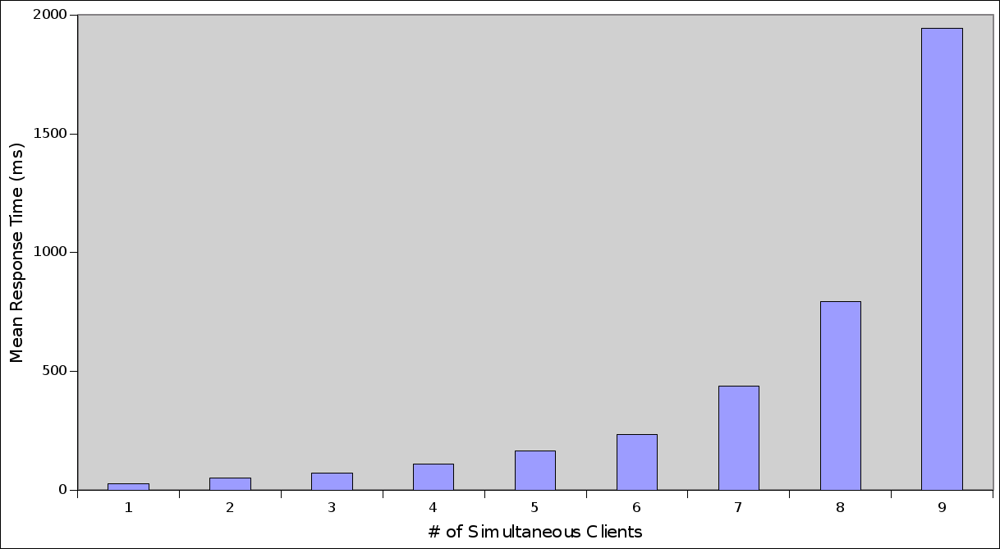

The primary concern of the performance of the system is due to the decision to use a single connection for the database. This severely limits the amount of concurrency possible with the system. In an attempt to discover the true scalability of the design, the following stress test was used. All tests were run using the Apache HTTP server benchmarking tool.

In this series of tests, 1000 index queries were performed against the web application. Each time the number of simultaneous connections increased, the response time dramatically climbed. Monitoring the system resources, the CPU utilization was approximately 100% for the majority of the testing. This suggests that there may be a serious computational bottleneck. This also indicates that the single database connector may not be as major a concern as previously believed.
